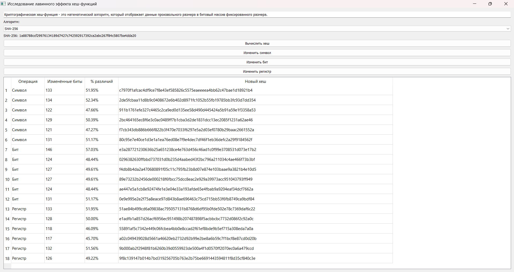
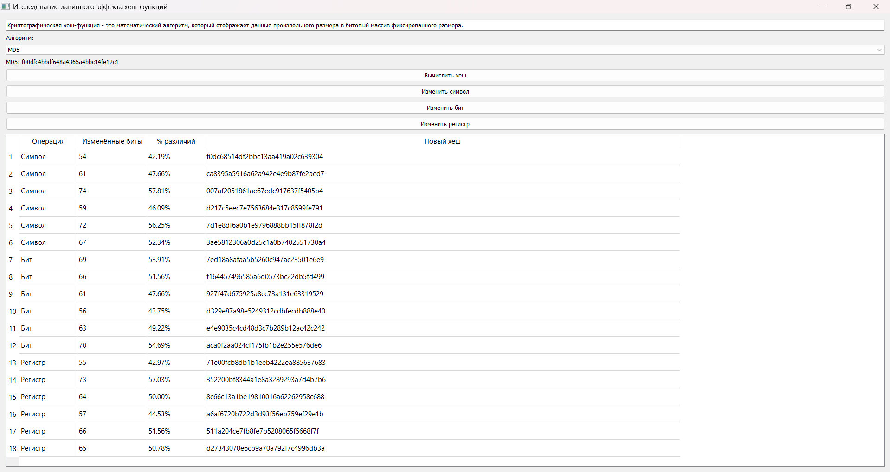
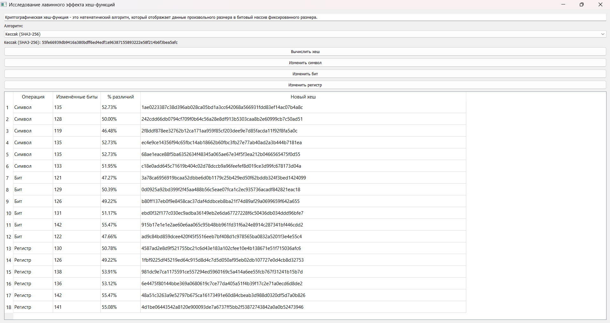
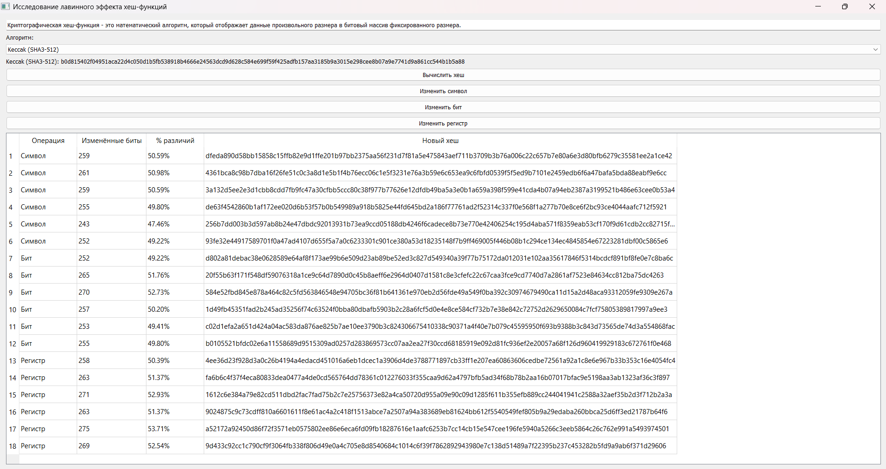

# Отчет по курсу
## «Основы информационной безопасности»
### Лабораторная работа №4 "Хеш-функции"

**Выполнил студент группы:**
6212-100503D  
Зарипов Дамир Радикович

---

## Задание - вариант 2

Разработать программу для исследования **лавинного эффекта криптографических хеш-функций**.

Требуется:
- реализовать вычисление хеш-значений для исходной строки
- реализовать типы мутаций исходных данных: изменение символа, бит или регистра
- оценить влияние малых изменений входа на результат хеширования
- измерить различие между хешами в битах и в процентах
- провести серию из не менее 10 экспериментов

---

## Описание решения задачи

Программа реализует исследование лавинного эффекта хеш-функций путём сравнения исходного и модифицированного входного текста.

Основные компоненты системы:

- `hash_utils.py` — вычисление хеш-значений
- `mutation_utils.py` — реализация методов мутации входных данных с использованием библиотеки `random`
- `analysis_utils.py` — анализ различий между хешами (битовая разница и процент изменений)
- `application.py` — графический интерфейс на PyQt5
- `main.py` — консольный режим экспериментов
- `tests.py` — юнит тесты

---

### Типы мутаций и хеширование

Для модификации входной строки реализованы три типа изменений:  
`change_one_char`, `change_one_bit`, `change_register`, которые обобщаются через функцию `apply_mutation(text, mode)`.

Вычисление хешей выполняется с помощью модуля `hashlib` для 5 алгоритмов:  
**SHA-256**, **MD5**, **BLAKE2s**, **SHA3-256**, **SHA3-512**

---

### Анализ различий

Оценка лавинного эффекта строится на операции XOR двух хеш-значений и последующем подсчёте количества отличающихся бит (`bit_count`).

Процент различий рассчитывается относительно общего числа бит, определяемого как `len(hash) * 4`:

`diff_bits / total_bits * 100`

---

### Интерфейсы программы

Запуск программы возможен в двух режимах.

В консольном интерфейсе `main.py` выполняется серия экспериментов с автоматическим выбором мутаций и выводом статистики.

Пример запуска:
`python main.py -s "string" -a "sha256" -c 15`

Графический интерфейс `application.py` предоставляет пользователю возможность ввода строки, выбора алгоритма, запуска мутаций по кнопкам и отслеживания результатов в таблице.

---

### Юнит-тестирование

Тестирование (`tests.py`) охватывает три основных класса сценариев:

- **Хорошие случаи**  
Проверяется корректная работа функций на типичных входных данных (корректная строка "word", валидный алгоритм sha256)

- **Граничные случаи**  
Проверяется поведение системы на предельных и специальных входных данных (пустая строка "", строка без букв "12345!!!")

- **Плохие случаи**  
Проверяется корректная обработка исключительных ситуаций (неизвестный алгоритм "unknown_algo", некорректный тип входных данных)

Запуск:
`python -m unittest tests.py`

---

## Результаты экспериментов

В ходе выполнения лабораторной работы было проведено 18 экспериментов для каждого из 5 используемых алгоритмов хеширования.  
В качестве входных данных использовалась строка:

"Криптографическая хеш-функция - это математический алгоритм, который отображает данные произвольного размера в битовый массив фиксированного размера."

Для каждого алгоритма фиксировались исходный хеш, изменённый хеш, количество изменённых бит и процент различий между хешами.

---

### Визуализация результатов

Ниже представлены результаты тестирования лавинного эффекта для различных алгоритмов хеширования.

### SHA-256

### MD5

### BLAKE2s

### SHA3-256

### SHA3-512

---

## Анализ результатов

По результатам проведённых экспериментов наблюдается устойчивое проявление лавинного эффекта.

Во всех алгоритмах процент различий колеблется вокруг 50%, что соответствует теоретически ожидаемому поведению качественных хеш-функций.

Для алгоритма **MD5** наблюдается наиболее широкий диапазон разброса значений — от 42% до 58%, что указывает на менее стабильное распределение изменений по сравнению с современными алгоритмами.

Алгоритмы **SHA-256** и **BLAKE2s** демонстрируют более узкий диапазон отклонений по сравнению с **MD5**.

Наиболее стабильные результаты показывают алгоритмы **SHA3-256**, особенно **SHA3-512**, где разброс значений минимален и наиболее близок к 50%.

Это свидетельствует о высокой степени равномерности распространения изменений.

Можно отметить следующую тенденцию: с увеличением длины хеш-значения и использованием более современных алгоритмов уменьшается вариативность отклонений от идеального значения лавинного эффекта.

---

## Вывод

В ходе работы была разработана программа для исследования лавинного эффекта различных криптографических хеш-функций.

Полученные результаты подтверждают ключевое свойство качественных хеш-функций — высокую чувствительность к малейшим изменениям входных данных.

Экспериментально установлено, что:
- все исследованные алгоритмы демонстрируют выраженный лавинный эффект
- среднее значение различий стабильно стремится к 50%
- современные алгоритмы обеспечивают более узкий разброс значений по сравнению с MD5
- увеличение длины хеша способствует повышению стабильности распределения изменений
