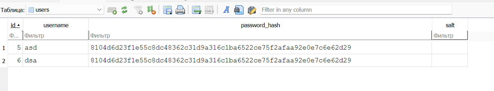
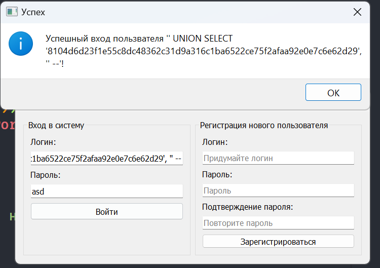
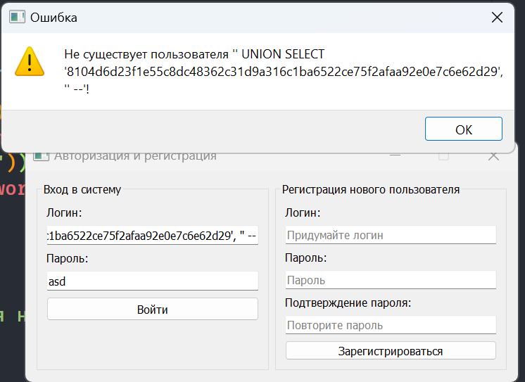

# Основы информационной безопасности

## Отчёт по Лабораторной работе №4 "Хеш-функции"

### Выполнил Должиков Дмитрий 6212-100503D

---

### Вариант 3

Хеширование паролей и защита учетных данных

### Цель работы

Изучить методы безопасного хранения паролей и реализовать систему аутентификации пользователей.

### Задание

1. Разработать программу, реализующую:

2. Регистрацию пользователя.

3. Хеширование пароля.

4. Генерацию соли.

5. Проверку пароля при авторизации.

---

## Ход работы:

Работа представляет из себя окно (PyQT5) для изучения и тестирования уязвимостей в системе хранения учетных данных в виде SQL таблицы.

Если хранить пароли от аккаунтов в открытом виде, то при взломк (утечке) таблицы
злоумышленники с легкостью получат доступ в систему от имени любого пользователя.
Для предотвращения этого пароли хранятся в виде **sha256** хэша.

---

Изначальная версия программы не использует соль для сохранения паролей, в результате этого,
два пользователя с одиноковыми паролями имеют одинаковый хэш в таблице, таким образом при утечке (взломе) таблицы, злоумышленнику будет
проще получить доступ ко всем таким пользователям, взломав всего один хэш. **(Пароль: _asd_)**



Затем я добавил генерацию соли и использование её при хэшировании пароля.
Теперь, даже если два пользователя будут иметь одинаковые пароли, то хэш их пароля все равно будет разный. **(Пароль: _asd_)**


---

На данный момент система более стойкая к утечкам базы данных, однако доступ в систему получить легко, так как в ней есть **_уязвимость (SQL инъекция)_**:

Сейчас код для обращения к базе данных выглядит так:

```python
def get_user(username: str, db_path: str):
    conn = sqlite3.connect(db_path)
    cursor = conn.cursor()
    cursor.execute(f"SELECT password_hash, salt FROM users WHERE username='{username}'")
    result = cursor.fetchone()
    conn.close()
    return result
```

Использование SQL запроса в таком виде позволяет злоумышленнику получить доступ в систему подменив хэш и соль с помощью следующего кода:

```SQL
' UNION SELECT '8104d6d23f1e55c8dc48362c31d9a316c1ba6522ce75f2afaa92e0e7c6e62d29', '' --
```

Здесь **'8104d6d23f1e55c8dc48362c31d9a316c1ba6522ce75f2afaa92e0e7c6e62d29'**
это хэш пароля "asd" без использования соли (второй параметр ' '). Таким образом, вписав этот код в строку логина и используя пароль asd, можно получить
доступ к системе, обойдя защиту паролем.



Для избежания подобных ситуаций следует использовать безопасный вариант SQL запросов:

```python
def get_user(username: str, db_path: str):
    conn = sqlite3.connect(db_path)
    cursor = conn.cursor()

    cursor.execute(
        f"SELECT password_hash, salt FROM users WHERE username=?", (username,)
    )
    result = cursor.fetchone()
    conn.close()
    return result
```

Теперь при попытке попасть в систему подобным образом, злоумышленника ждет неудача.



Таким образом программа была защищена от SQL инъекции, а также засчет использования соли при хэшировании пароля, была усилена защита паролей при утечке базы данных.

---

## Юнит-тесты

`test_generate_hash_returns_bytes()` - Проверка на соответствие типов данных и длины последовательности хэша

`test_same_password_same_salt_same_hash()` - Проверка что одинаковые пароли с одинаковой солью дают одинаковый хэш

`test_different_salt_different_hash()` - Проверка что одинаковые пароли с разной солью дают разный хэш

`test_different_password_different_hash()` - Проверка что разные пароли с одинаковой солью дают разный хэш

**Для запуска тестов необходимо поместить файлы tests.py crypto_utils.py в одну папку и выполнить в командной строке `pytest tests.py`**

---

## Вывод

В ходе работы была разработана программа для изучения принципов работы и уязвимостей систем авторизации и хранения учетных данных. Был проведен анализ уязвимостей и их исправление, а также было изучено поведение хэш функций с использовании соли при хэшировании

---
